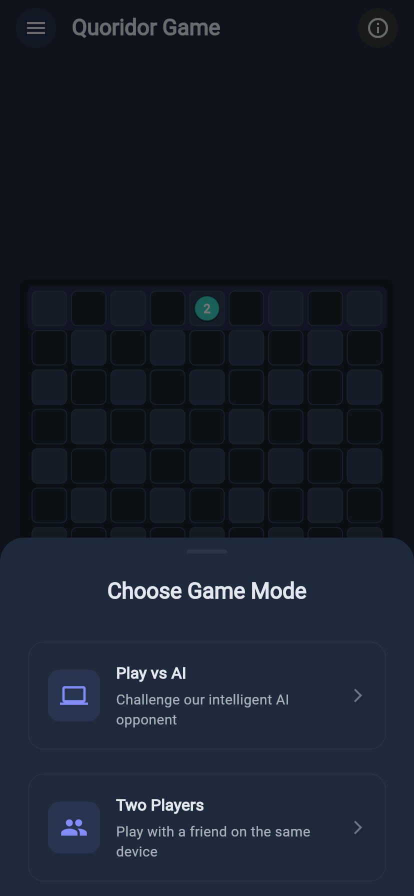
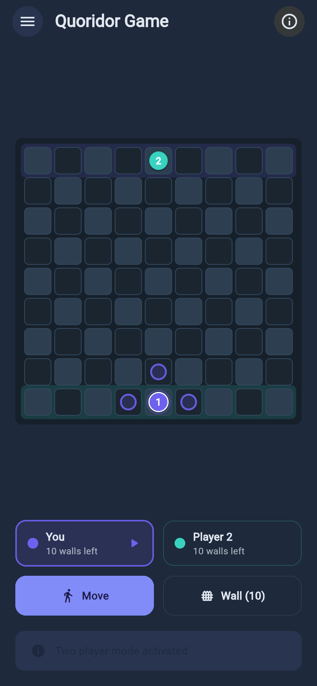
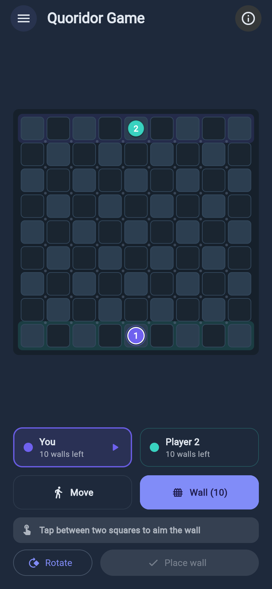
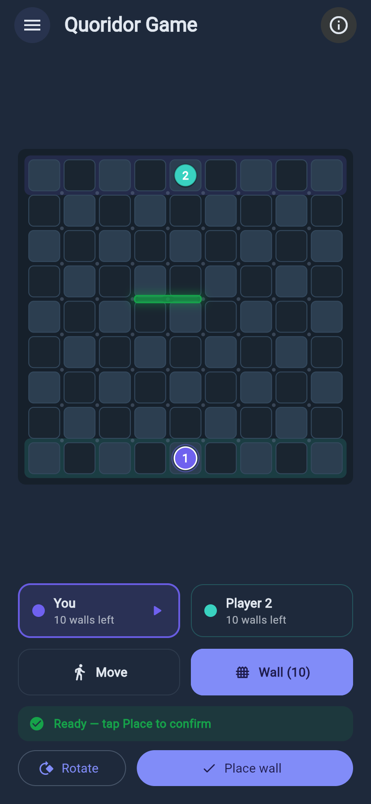
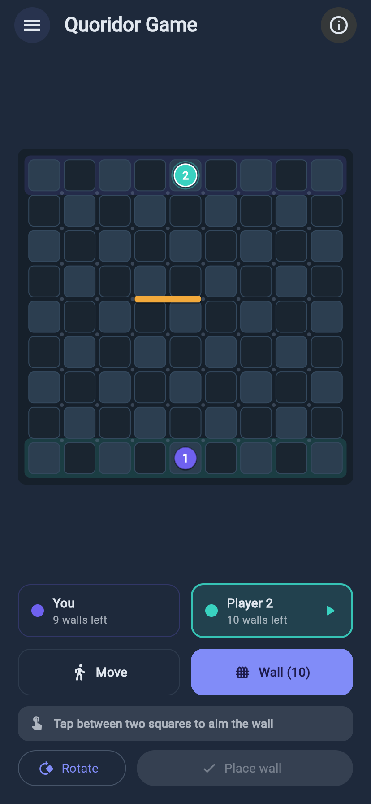
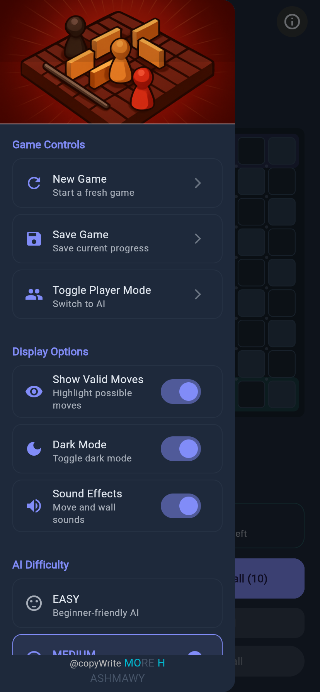

# Quoridor

A Quoridor board game built with Flutter and Flame. Race your pawn to the far
side of a 9×9 board while spending ten walls to slow your opponent down — and
never quite sealing them in, because that is against the rules.

Play against an AI opponent or against a friend on the same device. Runs on
Android, iOS, web, macOS, Windows and Linux from one codebase.

**[▶ Play it in your browser](https://3shmawi.github.io/quoridor/)** — the web
build is deployed to GitHub Pages from `main` on every push.

[](https://github.com/3shmawi/quoridor/actions/workflows/ci.yml)
[](https://github.com/3shmawi/quoridor/actions/workflows/deploy-pages.yml)
[](#)
[](https://flutter.dev)
[](https://flame-engine.org)

> **Store links — please fill these in.** The Google Play URL below is derived
> from the app's `applicationId` and should be correct, but it has not been
> verified. The App Store URL needs the numeric app ID from App Store Connect,
> which is not derivable from this repository.
>
> - Google Play: https://play.google.com/store/apps/details?id=com.MoRe_H.quoridor
> - App Store: `https://apps.apple.com/app/id<APP_ID>` ← replace `<APP_ID>`

## Screenshots

| Choose a game mode | Move mode | Wall mode |
|---|---|---|
|  |  |  |

| Aiming a wall | Wall placed | Settings |
|---|---|---|
|  |  |  |

All screenshots are from the web build, captured at phone size.

## How to play

Quoridor has two moves, and on your turn you pick exactly one of them.

**Move your pawn.** One square up, down, left or right — never diagonally, and
never through a wall. If the opponent's pawn is directly in your way you may
jump straight over it; if something blocks the square behind them, you may step
diagonally around them instead.

**Place a wall.** Each player has ten. A wall is two squares long and sits in
the groove between squares, blocking movement across it for both players. Walls
may not overlap or cross each other, and — the rule that makes the game — a
wall may never leave either player with no path at all to their goal row. It
may only make the journey longer.

You win by reaching the row on the opposite side of the board. Player 1 starts
at the bottom and runs to the top row; player 2 does the reverse. Both goal rows
are tinted on the board in the owner's colour.

### The controls

The board is in one of two modes at a time, chosen with the two buttons under
the board:

- **Move** — every square you can legally step to is ringed in your colour. Tap
  one to go there. That is the whole move; there is no pawn to select first.
- **Wall (n)** — small dots appear at every slot a wall can occupy. Tap
  anywhere near where you want the wall and it snaps to the nearest slot, then
  use **Rotate** to flip it between horizontal and vertical. The preview is
  green when the wall is legal and red when it is not, with the reason spelled
  out above the buttons ("Walls cannot cross each other", "This would leave a
  player with no way to their goal"). Nothing is committed until you tap
  **Place wall**.

## Running it

Requires the Flutter SDK (3.32 or newer; the pinned version is in `.fvmrc`).

```bash
flutter pub get
```

### Web — the quickest way to see it

```bash
flutter run -d chrome
```

Or build and serve it as a static site:

```bash
flutter build web --release --no-web-resources-cdn
cd build/web && python3 -m http.server 8080
```

`--no-web-resources-cdn` bundles CanvasKit into the build instead of loading it
from `gstatic.com`. Use it for any self-hosted deployment: it makes the build
self-contained, so it also works on networks that block Google's CDN.

### Mobile and desktop

```bash
flutter run -d android
flutter run -d ios
flutter run -d macos     # or windows, linux
```

### Tests and checks

```bash
flutter test
flutter analyze
```

## Configuration

### The AI opponent

The AI works out of the box with no setup: it plays with a local
pathfinding-based heuristic that follows its own shortest route and blocks
yours, with three difficulty levels in the settings drawer.

It can *optionally* consult a remote language model for strategy, which is off
unless you supply a key at build time:

```bash
flutter run --dart-define=QUORIDOR_AI_API_KEY=your-key-here
```

No key means the remote call is skipped entirely and the local AI plays. Keys
are never committed — see [Security](#security).

### Firebase

Firebase backs the optional save-and-resume feature and is configured in
`lib/firebase_options.dart`. The game does not wait for it at startup and stays
fully playable if it is unreachable; only saving and loading is unavailable.

To point the app at your own Firebase project, run `flutterfire configure`.

## Project layout

```
lib/
├── main.dart                    App entry, theming, audio lifecycle
├── theme.dart                   Light and dark themes
├── firebase_options.dart        Generated Firebase config
└── flame/
    ├── constants.dart           Board size, colours, Position / Wall / GameMove
    ├── board_component.dart     Board rendering and tap handling
    ├── wall_component.dart      Wall and wall-preview rendering
    ├── board/
    │   └── board_metrics.dart   Responsive geometry; maps taps to cells and slots
    ├── models/
    │   ├── game_state.dart      Board state, legal pawn moves, wall blocking
    │   └── player.dart          Pawn position, goal row, wall supply
    ├── game/
    │   ├── quoridor_game.dart   Flame game loop, turn flow, sound sequencing
    │   └── pathfinding.dart     Shortest path, used for rules and for the AI
    ├── services/
    │   ├── game_service.dart    Move validation and execution (pure, no UI)
    │   ├── ai_service.dart      AI opponent
    │   ├── audio_service.dart   Pooled, preloaded sound effects
    │   ├── identity_service.dart Anonymous per-device identity
    │   ├── firebase_service.dart Save / load games
    │   └── online/              Online play (no UI yet — see the plan)
    │       ├── room_code.dart
    │       ├── online_game_codec.dart
    │       └── online_game_service.dart
    └── pages/
        ├── game_page.dart       Game screen, turn controls, settings drawer
        └── menu_page.dart       Saved games
```

`GameService` and the models are pure Dart with no UI or engine dependencies,
so the rules can be tested directly — and reused unchanged by a future
networked opponent. See [`docs/ONLINE_MULTIPLAYER_PLAN.md`](docs/ONLINE_MULTIPLAYER_PLAN.md).

## Security

API credentials are supplied at build time via `--dart-define` and are not in
the source tree. If you fork this repository, do not commit keys to
`ai_service.dart` or anywhere else — use `--dart-define` or a CI secret.

The values in `lib/firebase_options.dart` are Firebase client identifiers.
Those are designed to be shipped inside client apps and are not secrets, but
they are only safe if your Firestore Security Rules are restrictive. Check your
rules before making a fork public.

## Online multiplayer

The groundwork is in place — device identity, the data model, Security Rules
and a service that can create, join, watch and play a game — but **there is no
lobby yet, so online play is not reachable from the app**. That screen is the
next piece of work.

Deploying the Security Rules is a separate step from shipping the app; until
they are pushed, online play is refused:

```bash
firebase deploy --only firestore:rules,firestore:indexes
```

Anonymous authentication must also be enabled in the Firebase console
(Authentication → Sign-in method → Anonymous).

See [`docs/ONLINE_MULTIPLAYER_PLAN.md`](docs/ONLINE_MULTIPLAYER_PLAN.md) for
the architecture, the Firebase/Supabase decision, the stored data model, and
what is and is not built.

## Roadmap

- [x] Local two-player and AI games
- [x] Responsive board that scales to the device
- [x] Wall placement with live validity feedback
- [x] Online groundwork: identity, data model, Security Rules, game service
- [ ] Online lobby: create, join by code, reconnect
- [ ] Clocks, resign and draw
- [ ] Public matchmaking
- [ ] Server-authoritative move validation
- [ ] Ranked play

## Credits

Built by [@3shmawi](https://github.com/3shmawi) (MoRe H. Ashmawy).
